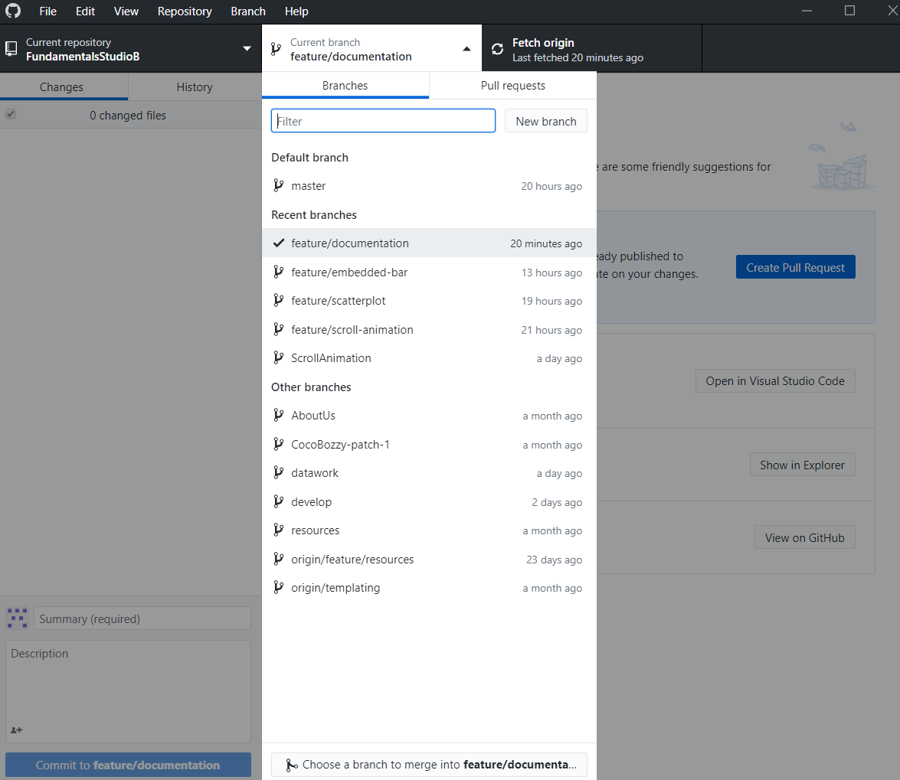
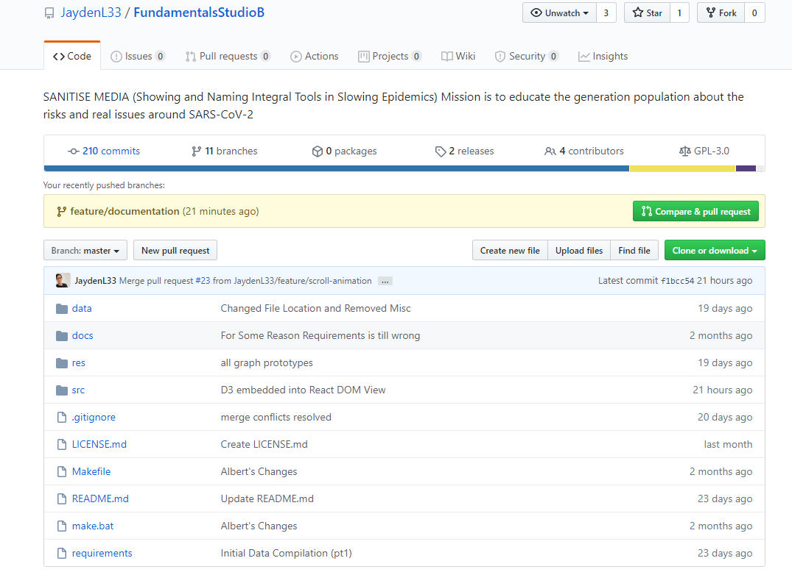
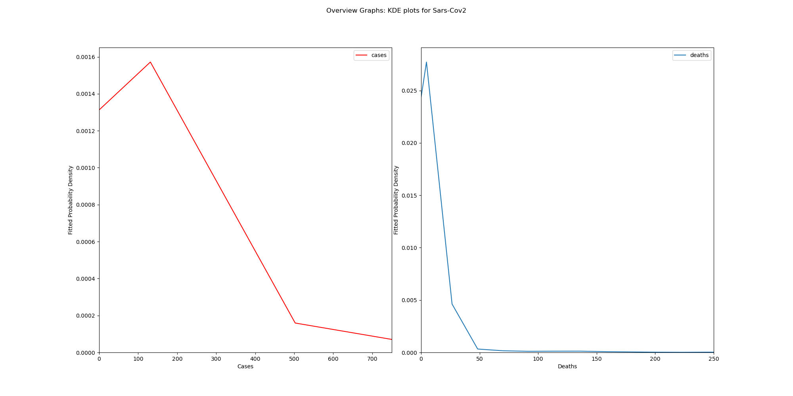
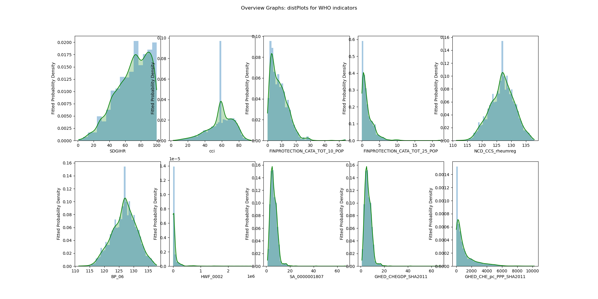

.. raw:: pdf

   PageBreak

Appendix A
**********

Reference Figures: Evidence of Team Process
==========================================

.. _GitBranching:

    Git Branching.

.. _GitMasterBranch:

    Git Master screenshot.

.. _TeamsCal:

    Teams Calendar.

.. _TeamsGeneralChat:

    Teams General Chat.

.. _TeamsNotebookOrig:

    Teams Notebook Orig.

.. _MicrosoftTasks:

    Microsoft Tasks (TODO).

.. raw:: pdf

   PageBreak

Reference Figures: Data Mining
==============================

.. _labelDistributionPlotsECDC:

    Deaths and Cases distribution plots.

:numref:`labelDistributionPlotsECDC` describes the PDF functions estimated in  discretely for clearer axis observations. 

.. _labelDistributionFrequencyWHO:

    Distribution and Frequency Plots of WHO Indicator Data.

:numref:`labelDistributionFrequencyWHO` shows a similar overview of KDE and frequency plots was generated for the WHO Indicator data in .