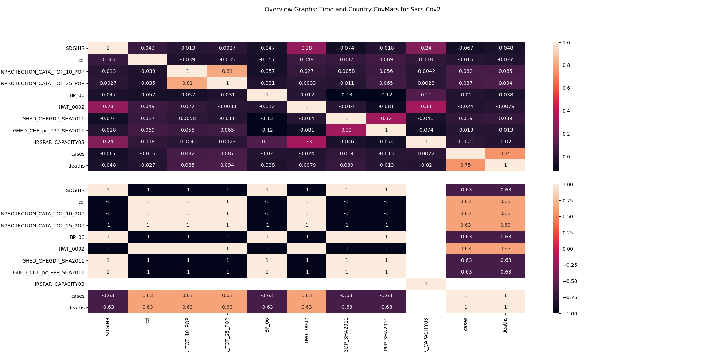
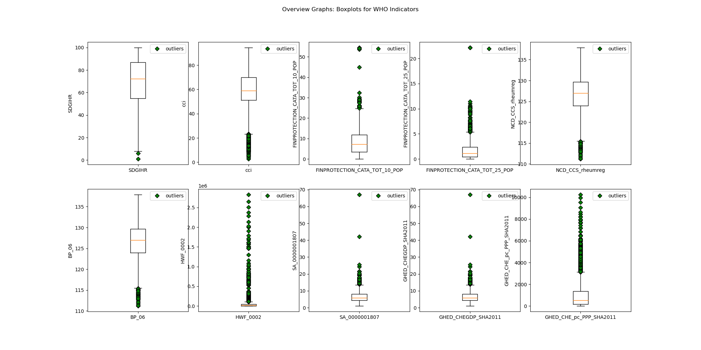
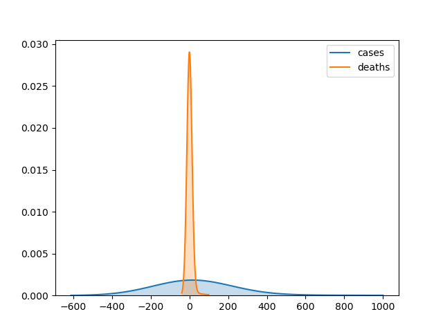

Requirements Specification
==========================

The **SANITISE.media** project is a conglomeration of several fundamental products. Each is required to fulfil the project’s abstract goals. The following is a description of the APIs
developed for each product. This section is structured as a description of the problems each API solves, grouped as per their functional, usable, and technical contributions to the whole.

For a more in-depth view of the functional breakdown of these API products, review the frontend or backend documentation sections.

Usability
---------

Fundamentally, every “API” product solves the meta aim of **SANITISE.media**. One of the primary goals of SANITISE.media is its ease-of-use and user experience. Every contributing API product aims 
to solve this issue.

API: UI/UX
----------

The UI and its UX are reliant on data abstraction and immediately simple, as well as concise, user interactions. This solution to this issue is the development of a frontend that
abstracts the data layer into concise and straightforward actions. It abstracts the CRUD (Create, Remove, Update and Delete) aspects of a database, where relevant, in addition to abstracting
the EVDA (Exploratory Visual Data Analysis) operations, an analyst would typically perform. Technically, this requires supporting data systems to abstract:

* a database. **MySQL** (MySQL 2020);
* a RESTful API routing system. **Flask** (Ronacher 2015);
* modelling and data *cleaner* (various custom scripts and services, see Appendix B: Backend, *cleaner*).

This API product also includes several technical dependencies:

* a visualisation engine. **D3.js** (Bostock 2020);
* a server-side rendering environment. **Node.js** (Node.js 2020) and **React.js** (Facebook 2020).

API: Database
-------------

A requirement of this ambitious data-centric project is a method and application of performing CRUD operations on the data in question. Further, a method of integrating new data, processing
updates and staging these changes for abstracted interface to the UI/UX API is fundamental to this project’s design. Technically, the implementation of a database requires a database engine, as
well as a supportive environment to run the engine and any paired application. This project utilises the MySQL application (MySQL 2020) to achieve this requirement. It is instantiated server-side and
designed to support the UI/UX API via a dependency on the RESTful API routing system (Flask (Ronacher 2015)). 

API: “Ingest”
-------------

A further dependency of the UI/UX API is a relevant data system to abstract. Although the MySQL database (MySQL 2020) solves the problem of CRUD operations upon the data set(s), a dependency on
the ingest of arbitrary data is still required. The (data) “ingest” API is a simple call-once API designed to ingest data. It is an atomic dependency of the project that forms the foundation of
the data layer and subsequent presentation layer (see Appendix B: Frontend, *various*).

Functionally, the Ingest API performs three operations once called. Initially, it cleans the ingested data sets, removing duplicates, standardising time formats, labelling data columns
appropriately, NaN filtering, etc. Further, the cleaning stage also encodes any relevant fields to binary or numeric values for later use in modelling. Secondly, the Ingest API call pushes
these changes to the MySQL database API, making the data available for later modelling and processing. This point is the earliest stage that the data is available to call upon by the UI/UX API.
Lastly, the Ingest API generates a report view of the ingested data for overview by the engineer calling the API. This view is shown below in :numref:`labelfigCovMats` as an example.

.. _labelfigCovMats:

    Time-axis compared covariance matrices for all data.

Data Research, Acquisition and Access
=====================================

Data Research
-------------

“What is the current SARS-Cov2 scenario globally?” This research question was the focus for determining data sources to acquire for this product. A secondary research question defined the focus
of this investigation by asking “what confounding factors may exist in this (COVID) scenario?” In answering these, the ECDC (ECDC 2020) and WHO (WHO 2020) formed high-quality secondary sources of
primary data. The ECDC (ECDC 2020) is a credible source for global SARS-Cov2 data, including details on countries that are typically more difficult to acquire (e.g. the U.S.A. and China).

The ECDC data set was of particular interest, as it was a singular source that included the U.S.A. and China datasets. Further, the ECDC exposes recent data through a simple to access URL
endpoint under the path covid19/casedistribution/csv (ECDC 2020). This endpoint allows a simple command, script or basic web scraper to acquire the data.

The research question posited the existence of confounding factors, and many must exist. Initially, health,
travel and economic data sources were considered from several sources. However, the scope of this project placed a time (and monetary) constriction on the acquisition and research of all of these
data sets. In particular, acquiring relevant economic data involved paid subscriptions, lest the data be redundant (more than two years old) and travel data (tourism specifically) is highly sparse 
and distributed data that would be too difficult to acquire quickly. The remaining data to acquire was simply the WHO datasets.

Which WHO datasets to utilise required more in-depth research of possible subsets. They, specifically those exposed by the G.H.O. Athena API (GHO WHO 2020), are publicly available and relevant to
this research. This source exposed a possible avenue of data mining for correlations in confounding health factors, perhaps comorbidities, for SARS-Cov2 cases.

The Datasets
^^^^^^^^^^^^

Eleven datasets were pulled from the Athena API (GHO WHO 2020). These included:

* Average of 13 International Health Regulations core capacity scores;
* Composite [Health] Coverage Index (%);
* Population with household expenditures greater than 10% of total household expenditure or income;
* Population with household expenditures greater than 25% of total household expenditure or income;
* Existence of Register of Patients who had Rheumatic Fever and Rheumatic Heart Disease;
* Medical Doctors  (number);
* Cancer, age-standardised death rates (15+), per 100,000 Population;
* Current Health Expenditure (C.H.E.) per capita in P.P.P. int$;
* and Zoonotic Events and the Human-animal Interface.

The sourced datasets above were explored, with testing and modelling to commence. Unfortunately, the scope of the project and extenuating circumstances interferes with a full
investigation. However, this topic is an option to be revisited later and given a priority of focus.

Exploring the Datasets, EVDA
^^^^^^^^^^^^^^^^^^^^^^^^^^^^

Briefly, an EVDA of the data shows the distributions of the ECDC and WHO Indicator datasets.
:numref:`labelWHOBoxes` describes the “outliers” of the WHO Indicator data. 
:numref:`labelKDEdeathscases` succinctly describes the PDF function estimates of ECDC recorded cases and deaths.
For more figures, see :numref:`labelDistributionPlotsECDC` and :numref:`labelDistributionFrequencyWHO` in Appendix A: *Reference Figures: Data Mining*.

.. _labelWHOBoxes:

    WHO Indicators boxplots.

.. _labelKDEdeathscases:

    Deaths and Cases KDE plot.

